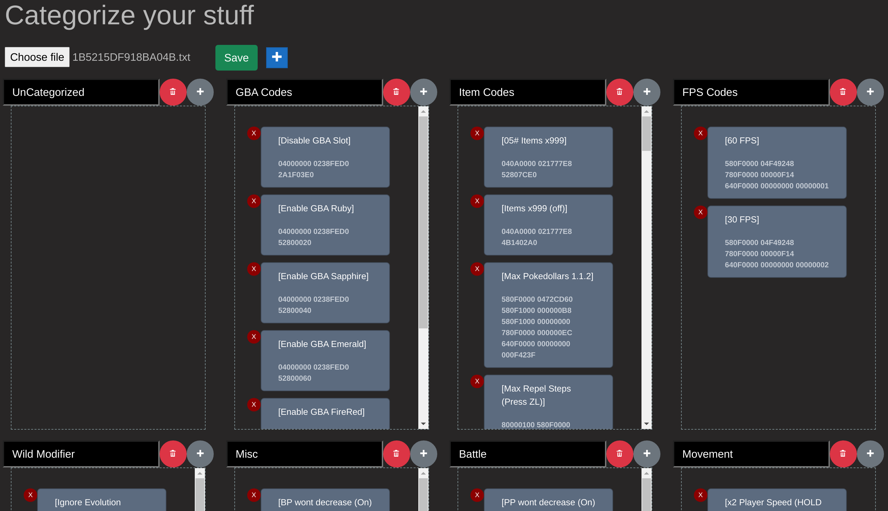
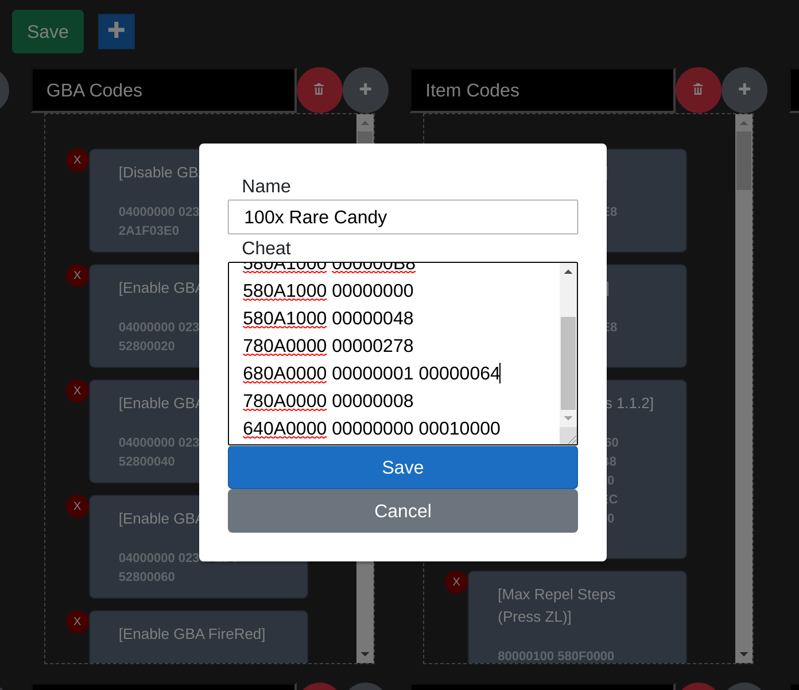
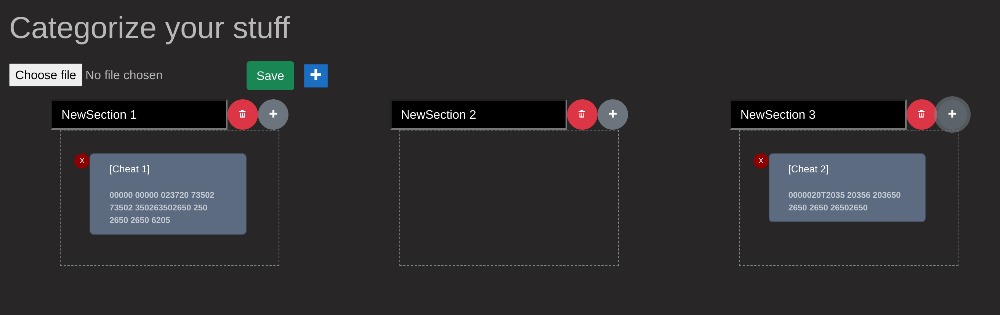

# EdizonCategorizer
[](https://edizonoverlaythingy.azurewebsites.net)
[](https://github.com/crashdummy/Modal/actions?query=workflow%3A%22Build+%26+Test+Main%22)


The EdizonCategorizer is a full fledged tool to create cheat files for atmosphere.  
The main purpose of this tool is to create a cheat file that can work with the updated [EdizonOverlay]  
The Frontend is driven by [Blazor]

# Features
* Read from existing cheat Files
* Add a new cheat into a section
* Move cheats between sections
* Delete cheats and/or whole sections

## Read existing cheatFiles
Existing cheat files can be deserialized into Sections.
Existing sections are translated into the new format.  

<details><summary><b>Before</b></summary>

```ini
[---GBA Codes---]
00000000 00000000 00000000

[Disable GBA Slot]
04000000 0238FED0 2A1F03E0

[Enable GBA Ruby]
04000000 0238FED0 52800020
```

</details>

<details><summary><b>After</b></summary>

```ini
[--SectionStart:GBA Codes--]
00000000 00000000 00000000

[Disable GBA Slot]
04000000 0238FED0 2A1F03E0

[Enable GBA Ruby]
04000000 0238FED0 52800020

[--SectionEnd:GBA Codes--]
00000000 00000000 00000000
```

</details>

If the cheat file was already created using this app, the already modified file can be read again.

# Screenshots
Read existing file ( Brilliant Diamond here )


Adding a cheat to a section  


Create a new Cheatfile 


# Requirements
* [.NET6](https://dotnet.microsoft.com/en-us/download/dotnet/6.0)

# Dependencies
* [Blazored.Modal] to display the Dialog to add a new cheat

# Build & run
```bash
|20:31:32|crashdummy@crashface:[edizonCategorizer]> [WriteSomeTests ✖] | 6 | 0 | 
 $ cd src/EdizonCategorizer/
|20:31:40|crashdummy@crashface:[EdizonCategorizer]> [WriteSomeTests ✖] | 6 | 0 | 
 $ dotnet run
Building...
info: Microsoft.Hosting.Lifetime[14]
      Now listening on: http://localhost:5081
info: Microsoft.Hosting.Lifetime[0]
      Application started. Press Ctrl+C to shut down.
info: Microsoft.Hosting.Lifetime[0]
      Hosting environment: Development
info: Microsoft.Hosting.Lifetime[0]
      Content root path: /home/crashdummy/coding/edizonCategorizer/src/EdizonCategorizer/
warn: Microsoft.AspNetCore.HttpsPolicy.HttpsRedirectionMiddleware[3]
      Failed to determine the https port for redirect.

```

[EdizonOverlay]: https://github.com/proferabg/EdiZon-Overlay
[Blazored.Modal]: https://www.nuget.org/packages/Blazored.Modal/
[Blazor]: https://docs.microsoft.com/en-us/aspnet/core/blazor/?view=aspnetcore-6.0